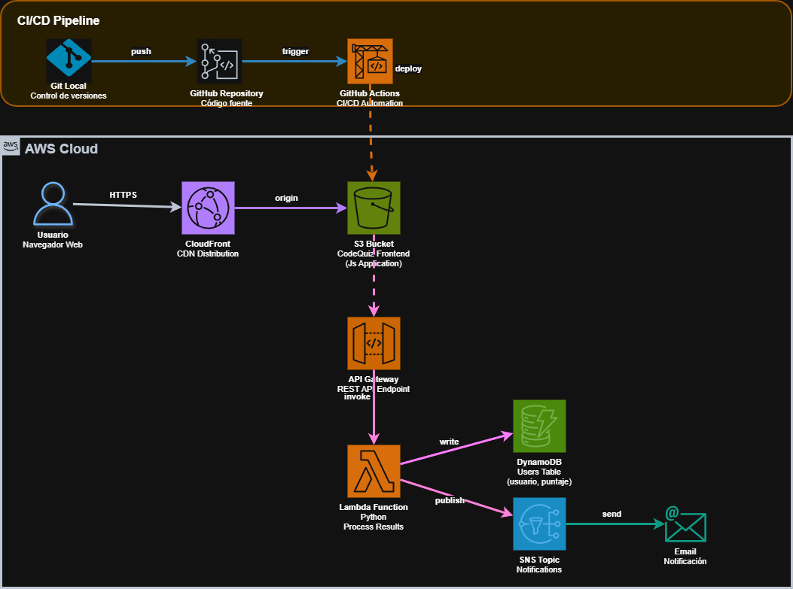
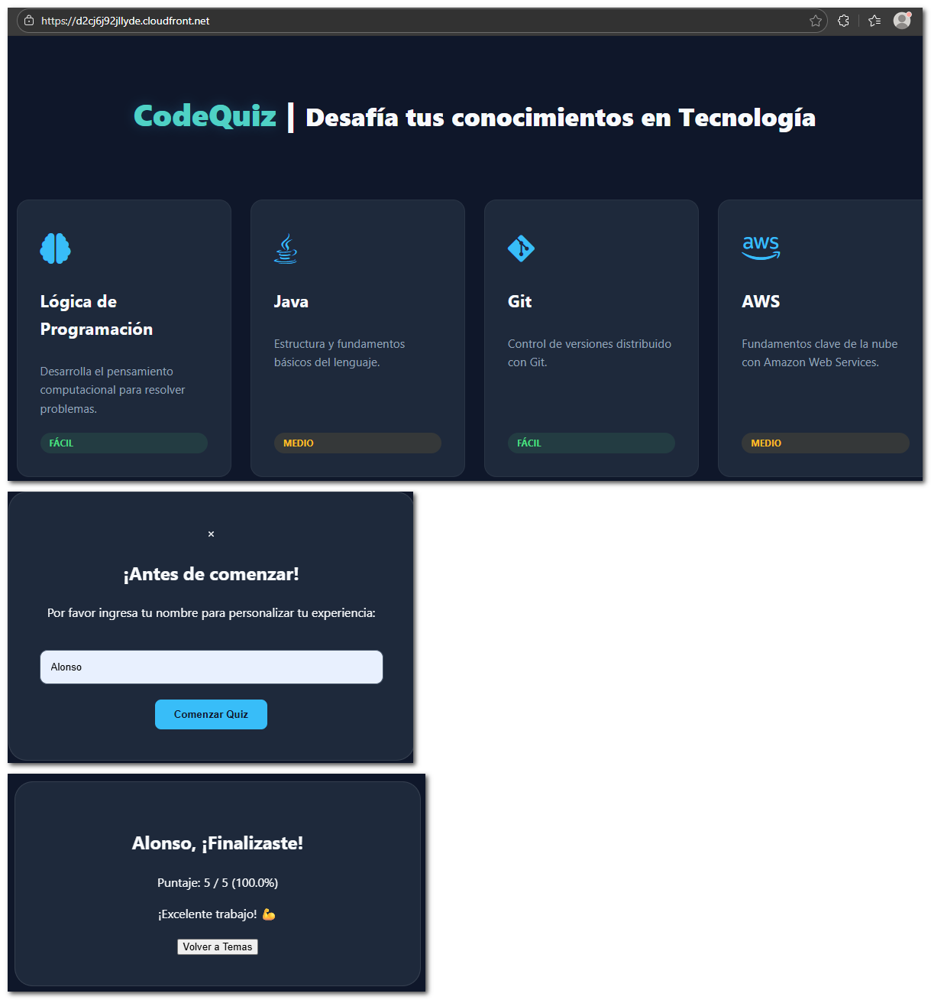

# 🧠 CodeQuiz — Arquitectura Serverless en AWS


---

## 📌 Descripción General

**CodeQuiz** es una aplicación de **quiz técnico** desarrollada con fines educativos y de práctica, pensada especialmente para personas que estamos dando sus primeros pasos en tecnología de nube, **CI/CD** y **infraestructura como código**.

Con fines de practica en **arquitectura e infraestructura**, la aplicación está desplegada en **AWS** utilizando una **arquitectura serverless**, combinando servicios como **CloudFront, S3, API Gateway, Lambda, DynamoDB y SNS** para lograr una solución **escalable, segura y altamente disponible**.

Toda la infraestructura se gestiona mediante **Terraform (IaC)**, lo que permite despliegues consistentes y reproducibles. Además, cuenta con un **pipeline de CI/CD con GitHub Actions** que automatiza el despliegue de la infraestructura.

---

🌐 **Demo en vivo:** https://d2cj6j92jllyde.cloudfront.net

---

## 🏗️ Arquitectura



### Interfaz de Usuario (Demo)



---

## 🔄 Flujo de Trabajo del Proyecto

El desarrollo y despliegue del proyecto se realizo con los siguientes pasos:

1. **Configuración del Entorno**  
   Se estableció la comunicación con AWS mediante el **AWS CLI**, configurando credenciales seguras para permitir despliegues automatizados.

2. **Infraestructura como Código (IaC)**  
   Con **Terraform** se definieron y aprovisionaron de forma declarativa todos los recursos de red, cómputo y almacenamiento.

3. **Entrega de Contenido (Frontend)**  
   - Archivos estáticos (`index.html`, `style.css`, `app.js`) alojados en **Amazon S3**.
   - **Amazon CloudFront** configurado como CDN para reducir latencia y habilitar **HTTPS**.
   - Uso de **Origin Access Control (OAC)** para proteger el bucket S3.

4. **Backend Serverless**  
   - **API Gateway (HTTP API)** como punto de entrada seguro.
   - Gestión de políticas **CORS**.
   - Función **AWS Lambda** escrita en **Python 3.13** para procesar las solicitudes.

5. **Persistencia y Notificaciones**  
   - Registro de puntajes en **Amazon DynamoDB** (NoSQL, escalado bajo demanda).
   - Envío de notificaciones por correo mediante **Amazon SNS**.

6. **Automatización CI/CD**  
   - **GitHub Actions** ejecuta automáticamente el despliegue de infraestructura y backend ante cada cambio en el repositorio.

---

## 🛠️ Tecnologías y Servicios Utilizados

| Capa | Servicio / Tecnología | Función |
|---|---|---|
| **Distribución** | Amazon CloudFront | CDN global con caché y terminación SSL (HTTPS). |
| **Almacenamiento** | Amazon S3 | Hosting de archivos estáticos altamente disponible. |
| **API** | API Gateway (HTTP) | Orquestación de peticiones REST y CORS. |
| **Cómputo** | AWS Lambda | Lógica de negocio serverless y escalable. |
| **Base de Datos** | Amazon DynamoDB | Almacenamiento NoSQL de puntajes y usuarios. |
| **Mensajería** | Amazon SNS | Notificaciones en tiempo real vía Email. |
| **Automatización** | Terraform / GitHub Actions | Infraestructura como Código y CI/CD. |

---

## 📂 Estructura del Repositorio

```text
.
├── .github/workflows/        # Pipelines de CI/CD (GitHub Actions)
├── terraform/                # Infraestructura como Código (IaC)
│   ├── main.tf               # S3, CloudFront, Lambda, DynamoDB, SNS
│   ├── variables.tf          # Variables de configuración
│   └── outputs.tf            # URLs de API y CloudFront
├── lambda/                   # Backend serverless
│   └── index.py              # Lógica en Python (DynamoDB y SNS)
└── web/                      # Frontend
    ├── index.html            # Interfaz de usuario
    ├── style.css             # Diseño responsivo
    └── app.js                # Consumo de la API (Fetch)
```

---

## 🚀 Guía de Despliegue

### 1️⃣ Preparar AWS CLI

Configure sus credenciales de AWS:

```bash
aws configure
```

### 2️⃣ Desplegar Infraestructura con Terraform

```bash
cd terraform
terraform init
terraform apply --auto-approve
```

### 3️⃣ Conectar Frontend con Backend

- Copie el valor de `api_endpoint` generado por Terraform.
- Péguelo en la variable `API_URL` dentro del archivo:

```text
web/app.js
```

### 4️⃣ Confirmar Suscripción SNS

- Revise su correo electrónico.
- Confirme la suscripción al tópico **SNS**.

⚠️ Sin esta confirmación, AWS no enviará notificaciones de puntajes.

---

## 🛡️ Seguridad Implementada

- **Origin Access Control (OAC):**  
  El bucket S3 es privado y solo CloudFront tiene permisos de lectura.

- **Gestión de CORS:**  
  API Gateway y Lambda permiten solicitudes únicamente desde el dominio del frontend.

- **IAM – Principio de Mínimo Privilegio:**  
  La función Lambda solo tiene permisos para:
  - `dynamodb:PutItem`
  - `sns:Publish`

---

## 👨‍💻 Autor

**Desarrollado por:** Alonso Vargas  
**Ingeniero de Telecomunicaciones:**

---

⭐ Si este proyecto te resulta útil, ¡no olvides darle una estrella al repositorio!

